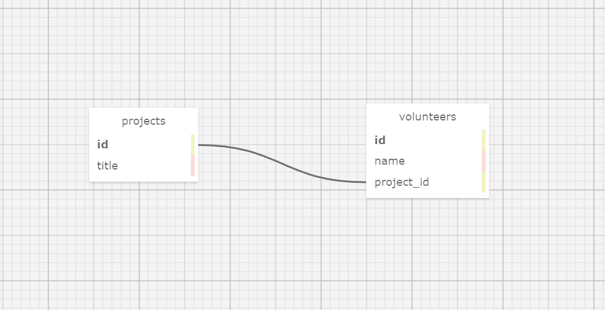

# _The Amazing Project Volunteererizer!_

#### By _**Matt C.**_

#### _Ruby code review #3 on Databases with Postgres_

## Description
_A webapp for orginizing projects and assigning volunteers to them. All projects and volunteers have total CRUD functionality._

## Database Schema

## Technologies Used

* _Ruby_
* _rspec_
* _pry_
* _[Docker](https://www.docker.com/)(optional)_
* _Sinatra_
* _Capybara_
* _PostgreSQL_

## Using this app with Ruby 2.6.5 installed natively (no Docker)

* _Run_ `git clone https://github.com/catperso/volunteer-tracker-two` _in your terminal to clone this repository to your device, then navigate to the project directory._
* _Run_ `bundle` _to package the Gems and set up Gemfile.lock._
* _Run_ `postgres` _to launch postgres._
* _Run_ `createdb volunteer_tracker` _to create a blank database._
* _Run_ `psql volunteer_tracker < database_backup.sql` _to copy the backup into the database._
* _Run_ `createdb -T volunteer_tracker volunteer_tracker_test` _to create the test database._
* _Run_ `exit` _to exit postgres._
* _Run_ `rspec` _if you want to run the specs for the classes and Capybara integration._
* _Run_ `ruby app.rb` _to start a local server._
* _Open up your web browser and go to_ `http://localhost:4567/` _while the server is running to experience the project!_

## Using this app with Docker

* _First make sure Docker is installed as per the official [instructions](https://docs.docker.com/get-docker/)._
* _Run_ `docker pull ruby:2.6.5` _to pull an image for the same version of Ruby this project was built with._
* _Run_ `git clone https://github.com/catperso/volunteer-tracker-two` _in your terminal to clone this repository to your device, then navigate to the project directory._
* _Run_ `docker-compose run db` _to start the database container to create the databases._
* _In another terminal window, run_ `docker ps` _to display all the running containers. Look for the CONTAINER ID of the one you just started (it will look something like '3e51699f2997', but will be different on your system)._
* _Run_ `docker exec -it -u postgres [CONTAINER ID] psql` _to launch psql. Replace [CONTAINER ID] (including the brackets) with the ID of your postgres container._
* _Run_ `CREATE DATABASE volunteer_tracker;` _to create a blank development database._
* _Run_ `CREATE DATABASE volunteer_tracker_test;` _to create a blank test database._
* _Run_ `exit` _to exit psql._
* _Run_ `docker exec -i [CONTAINER ID] psql --username postgres volunteer_tracker < database_backup.sql` _replacing [CONTAINER ID] (including the brackets) with the ID of your postgres container, to restore the development database from the backup._
* _Run_ `docker exec -i [CONTAINER ID] psql --username postgres volunteer_tracker_test < database_backup.sql` _replacing [CONTAINER ID] (including the brackets) with the ID of your postgres container, to restore the test database from the backup._
* _In the initial terminal window running the postgres container, press `ctrl + c` to gracefully shut it down._
* _Run_ `docker-compose run --rm web bundle exec rspec` _if you want to run the specs for the classes and Capybara integration._
* _Run_ `docker-compose up --build` _to start a local server._
* _Open up your web browser and go to_ `http://localhost:4567/` _while the server is running to experience the project!_

## Known Bugs

* _Two of the integration tests are commented out because capybara is unable to find the correct input fields to test this functionality. No matter what I tried, it always told me `Unable to find field that is not disabled`. All the rest of the specs (integration or otherwise) are passing as expected._

## License - [MIT](https://opensource.org/licenses/MIT)

_If you run into any problems/bugs feel free to send me an email [(mc.casperson@gmail.com)](mailto:mc.casperson@gmail.com) with details._

Copyright (c) _2021_ _Matt C._